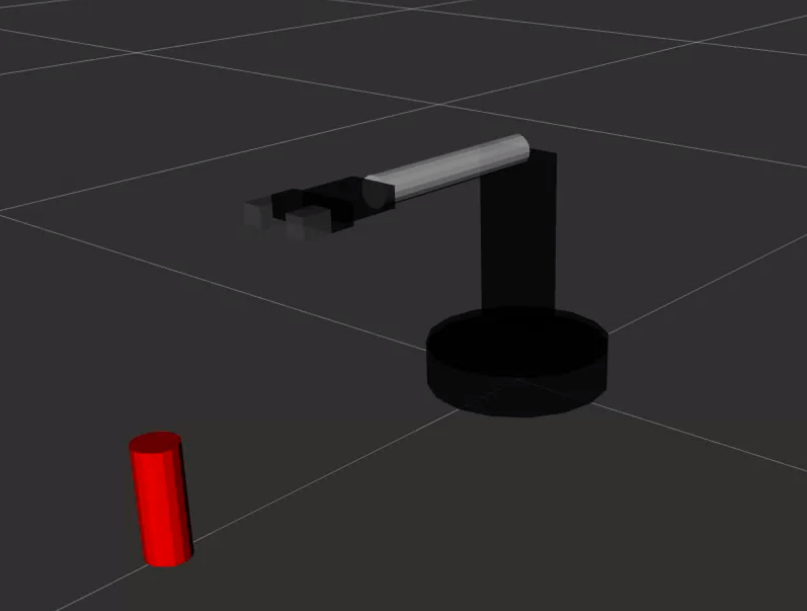
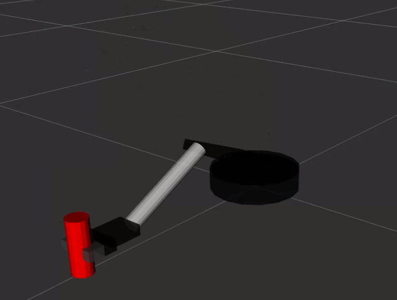
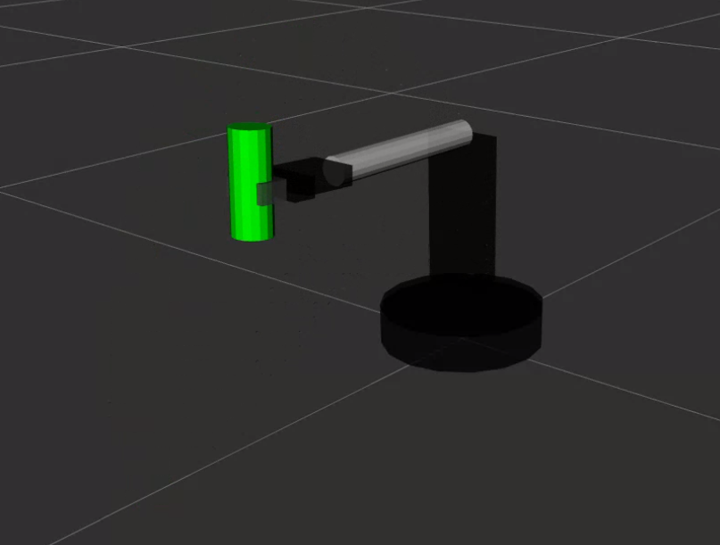
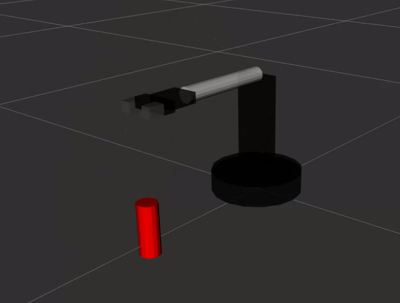
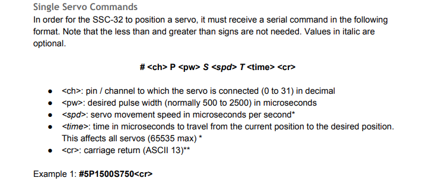
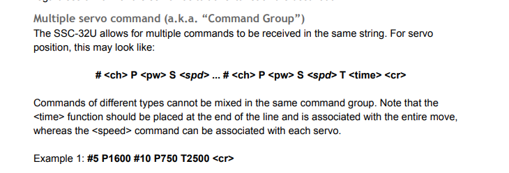

# worbp2_final

Een ROS 2-project waarbij een robotarm een kopje oppakt, kantelt en loslaat met behulp van `servo commands`. De arm wordt virtueel aangestuurd en gevisualiseerd in RViz.

<p align="center">
   
   
   
   
</p>   


---

## 📦 Benodigdheden

Zorg dat je onderstaande componenten geïnstalleerd hebt:

- **ROS 2 Jazzy Jalisco**
- **RViz2**
- **TF2**

---

## ⚙️ Installatie

1. Clone deze repository:
   ```bash
   git clone git@github.com:AgitDev-sudo/worbp2_final.git
   ```

2. Ga naar de root van de workspace:
   ```bash
   cd worbp2_final
   ```

3. Build de workspace:
   ```bash
   colcon build
   ```

---

## 🚀 Demo uitvoeren

> ⚠️ Vergeet niet om in elke nieuwe terminal de ROS-omgeving te sourcen:

```bash
source install/setup.bash
```

1. Start de simulatie:
   ```bash
   ros2 launch simulation simulation_launch.py
   ```

2. Open een tweede terminal en start het script:
   ```bash
   ./pickup_cup_sequence.sh
   ```

   Geen uitvoerrechten? Verleen toegang:
   ```bash
   chmod +x pickup_cup_sequence.sh
   ```

In deze demo zie je hoe de robotarm een kopje oppakt, verplaatst en weer loslaat.

Een demo in video formaat is [hier te vinden](./demo_videos/demo_robot_arm.webm).

Dezelfde demo met terminal window is [hier](./demo_videos/demo_with_terminal.webm) te vinden.

---

## 🧩 API & Node-overzicht

Deze sectie geeft een overzicht van de gebruikte ROS-nodes. De voorbeelden hoe de nodes standalone draaien worden puur weergeven om inzicht te geven welke parameters er opgegeven kan worden aan een node.
Het is aangeraden om de launch file van de simulation package te gebruiken hierin zijn alle default argumenten verwerkt:
```bash
ros2 launch simulation simulation_launch.py
```

De losse nodes kunnen ook apart gestart worden voor test- of debuggingsdoeleinden.

---

### 🤖 virtual_servo_controller_node

**Standalone opstarten:**
```bash
ros2 run simulation virtual_servo_controller_node --ros-args \
  -p robot_description_file:=$(ros2 pkg prefix simulation)/share/simulation/urdf/lynxmotion_arm.urdf
```

**Met RViz, cup_node en robot_state_publisher (aanbevolen):**
```bash
ros2 launch simulation simulation_launch.py
```

---

#### Commando's zonder response
Commando's sturen naar de virtuele servo controller:
Volgens de specificatie van de SSC32U protocol zijn er commando's waar je wel of geen antwoord op krijgt. Hieronder volgen de commando's die de ros package ondersteunen waarvan we geen antwoord verwachten.

##### 🔧 Servo-aansturing

Volgens het SSC32U-protocol zijn er commando’s die geen response genereren. Hieronder een aantal voorbeelden:

```bash 
ros2 topic pub --once /ssc32u_command std_msgs/msg/String '{data: "#3 P1700 T800\r"}' #Beweeg servo 3 met een pwm waarde van 1700 binnen 800 ms.
ros2 topic pub --once /ssc32u_command std_msgs/msg/String "{data: \"#0 P2500 T10000\r\"}" #Beweeg servo 0, de base, helemaal naar in 10 seconde. 
ros2 topic pub --once /ssc32u_command std_msgs/msg/String "{data: \"#2 P1800 S800\r\"}" #Beweeg servo 2 met een snelheid van 800us/S naar positie 1800.
ros2 topic pub --once /ssc32u_command std_msgs/msg/String "{data: \"#3 P1800 S800 T1000\r\"}" #Servo berekent met behulp van zijn huidigie positie met welke tijd die het langst over mag doen en die neemt die!

ros2 topic pub --once /ssc32u_command std_msgs/msg/String "{data: \"#5 P1507 T1000\r\"}" #Sluit gripper in 1 seconde. (1 servo voor de gesimuleerde linker en rechter gripper)

ros2 topic pub --once /ssc32u_command std_msgs/msg/String "{data: \"#5 P1500 T1000\r\"}" #Open gripper

ros2 topic pub --once /ssc32u_command std_msgs/msg/String "{data: \"#4 P1800\r\"}" #Valide commando, wordt geparsed, maar wordt niet uitgevoerd, omdat we de maximale snelheid van de echte servo niet weten heb ik dit niet mee genomen. 
```


---

#### 🛑 Servo stoppen

##### Stoppen van servo:
```bash
ros2 topic pub --once /ssc32u_command std_msgs/msg/String '{data: "STOP 0\r"}' ## Stop servo 0 (dus de base)
ros2 topic pub --once /ssc32u_command std_msgs/msg/String '{data: "STOP 1\r"}' ## Stop servo 1
ros2 topic pub --once /ssc32u_command std_msgs/msg/String '{data: "STOP\r"}' ##Stop alle servos
```

---

#### 👥 Group Commands (nog niet ondersteund)

```bash
ros2 topic pub --once /ssc32u_command std_msgs/msg/String '{data: "#0 P2500 S1000 #1 P800 T2000\r"}'
```

➡️ Wordt wel geparsed, maar niet uitgevoerd. De parsing is volledig getest en wordt correct verwerkt in het `SSC32UCommand` datatype.



---

#### ✅ Ondersteuning & validatie

- ✅ Pins: 0–5
- ✅ Parameters: `P`, `T`, `S` (combinaties ook)
- ❌ Alleen `P` wordt niet uitgevoerd
- ❌ Groupcommands worden genegeerd
- ✅ Alle servos kunen met een commando gestopt worden (volgens de ssc32u specificatie)
- ✅ Een enkele servo kan met een commando gestopt worden (volgens de ssc32u specificatie)
- ✅ Status van arm kan opgevraagd worden (zie paragraaf "Voorbeeld — armstatus opvragen")
- ❗ Ongeldige commando’s leveren foutmeldingen op

---

#### 💡 Verbeterideeën voor toekomstige studenten

1. **Ondersteuning voor alleen `P`-waarde:**
   ```bash
   ros2 topic pub --once /ssc32u_command std_msgs/msg/String '{data: "#0 P1800\r"}'
   ```
Het parsen zit er in echter de uitvoering niet, omdat ik de hardware limit / max speed van de betreffende servo niet weet. Wanneer geen P of T is opgegeven dan hoort een servo zo snel mogelijk naar desbetreffende positie te gaan. Dit is natuurlijk afhankelijk van de hardware.

2. **Volledige uitvoering van groupcommands.**

---

#### 📡 Commando’s met response

Responses worden gepubliceerd op het topic:

```bash
ros2 topic echo /ssc32u_response
```

**Voorbeeld — armstatus opvragen:**
```bash
ros2 topic pub --once /ssc32u_command std_msgs/msg/String '{data: "Q\r"}'
```

- `"+"` = arm beweegt  
- `"."` = arm is stil

---

### 🦴 robot_state_publisher

**Standalone opstarten:**
```bash
ros2 run robot_state_publisher robot_state_publisher --ros-args \
  -p robot_description:="$(cat $(ros2 pkg prefix simulation)/share/simulation/urdf/lynxmotion_arm.urdf)" \
  -p use_sim_time:=false
```

---

### ☕ cup_node

**Standalone opstarten:**
```bash
ros2 run simulation cup_node --ros-args \
  -p use_sim_time:=false \
  -p cup_pose.x:=0.45 \
  -p cup_pose.y:=0.0 \
  -p cup_pose.z:=0.05 \
  -p cup_pose.roll:=0.0 \
  -p cup_pose.pitch:=0.0 \
  -p cup_pose.yaw:=0.0 \
  -p cup_desc:="$(cat $(ros2 pkg prefix simulation)/share/simulation/urdf/cup.urdf)"
```

➡️ De `cup_node` plaatst een virtueel kopje in de wereld. Dit kan met de pose argumenten.

---

### 👁️ rviz2

**Standalone opstarten:**
```bash
ros2 run rviz2 rviz2 -d $(ros2 pkg prefix simulation)/share/simulation/rviz/urdf.rviz
```

---